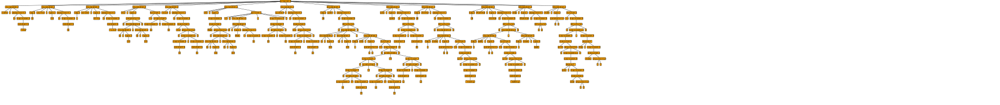

<div align="center">

# Tite

Tite is a programming language designed to be concise, intuitive, and efficient.

`main: () => print("hello, world")`

</div>

## Key Features

- **Familiar Syntax:** Blends the familiarity of Python, Rust, Go, and JavaScript.
- **Zero Keywords:** Utilizes special characters for mutability, visibility, and type declarations.
- **Multi-Paradigm:** Supports both object-oriented and functional programming.

## Philosophy

Tite aims to provide a strict and concise coding environment, allowing developers to write clear and efficient code without the burden of numerous keywords with subtle distinctions. 

There are only a few basic rules in Tite:

1. Declarations use the format `identifier: type = expression`, where the `type` is optional.
2. Unless preceded by a **tag** (special character), identifiers are immutable and private by default.

Programming languages often become more complex with the addition of new features. Tite avoids this by using a limited number of tags; `.` for visibility, `$` for mutability, `#` for types, etc. This minimalist approach simplifies and unifies the declaration process, ensuring the language remains intuitive and consistent.

## Example Code

### Variable Declaration

```rust
language := "Tite" // Type inference
$counter: int = 0 // Mutable binding
.version: string = "1.0.0" // Public visibility
```

### Function Declaration

```rust
mul: (a:int, b:int) => a * b
$result := mul(5, 5)

div: (a:int, b:int) float => {
    d: float = a
    (d / b) // Return value
}
result = div(5, 3)
```

### Type Definition

```rust
#point := {
    x: int
    y: int
    .dist: () => (x**2 + y**2)**(1/2)
}
pos: point = {3, 4}
print(pos.dist()) // Output: 5
```

### Inheritance and Overriding

```rust
#Animal := {
    .move: () => print("moving")
}

#Mammal: Animal = {
    .walk: () => print("walking")
    .move = walk // Override move with walk
}

dog: Mammal = {}
dog.move() // Output: walking
```

## Community

Join **Titans** (tentative), our community of Tite developers, for support, discussion, and contributions.

## Getting Started

Currently, Tite is a project work in progress.

You can see the parse tree of example code by running `./test.sh` from the terminal



Visit [tite.dev](https://tite.dev) for detailed documentation, tutorials, and resources.
